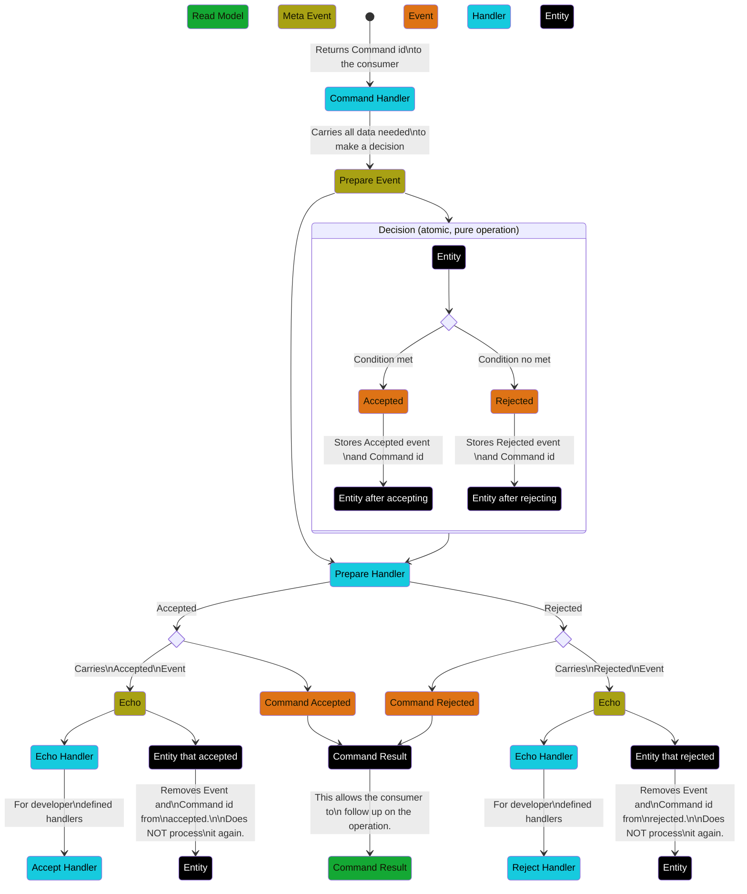

```mermaid
stateDiagram-v2
  state "Read Model" as rm
  state "Command Handler" as ch
  state "Prepare Event" as pe
  state "Entity" as ent
  state "Entity" as ent2
  state "Entity" as ent3
  state "Prepare Handler" as ph
  state accepting_command <<choice>>
  state processing_accepted_event <<choice>>
  state processing_rejected_event <<choice>>
  state "Entity after accepting" as eaa
  state "Entity that accepted" as eta
  state "Entity that rejected" as etr
  state "Entity after rejecting" as ear
  state "Command Accepted" as ca
  state "Command Rejected" as cmdrjct
  state "Echo" as ma
  state "Echo" as mr
  state "Meta Event" as me
  state "Command Result" as cmdrslt
  state "Command Result" as cmdrsltrm
  state "Accept Handler" as ah
  state "Reject Handler" as rh
  state "Decision (atomic, pure operation)" as decision
  state "Echo Handler" as eha
  state "Echo Handler" as ehr

  classDef event fill:#de7316
  classDef metaEvent fill:#a8a114
  classDef handler fill:#16cade,color:black
  classDef entity fill:black,color:white
  classDef readModel fill:#14a834

  [*] --> ch: Returns Command id\nto the consumer
  Event
  Handler
  Entity
  rm
  ma
  mr
  me
  ch --> pe: Carries all data needed\nto make a decision
  pe --> decision
  pe --> ph
  state decision {
    ent --> accepting_command
    accepting_command --> Accepted: Condition met
    accepting_command --> Rejected: Condition no met
    Accepted --> eaa: Stores Accepted event \nand Command id
    Rejected --> ear: Stores Rejected event \nand Command id
  }
  decision --> ph
  ph --> processing_accepted_event: Accepted
  ph --> processing_rejected_event: Rejected
  processing_accepted_event --> ma: Carries\nAccepted\nEvent
  processing_accepted_event --> ca
  processing_rejected_event --> cmdrjct
  processing_rejected_event --> mr: Carries\nRejected\nEvent
  ca --> cmdrslt
  cmdrjct --> cmdrslt
  cmdrslt --> cmdrsltrm: This allows the consumer to\n follow up on the operation.
  ma --> eha
  eha --> ah:For developer\ndefined handlers
  ma --> eta
  mr --> ehr
  ehr --> rh:For developer\ndefined handlers
  mr --> etr
  etr --> ent2: Removes Event and\nCommand id from\nrejected.\n\nDoes NOT process\nit again.
  eta --> ent3: Removes Event and\nCommand id from\naccepted.\n\nDoes NOT process\nit again.

  class Accepted, Rejected, Event, ca, cmdrjct event
  class ch, ph, Handler, ah, rh, eha, ehr handler
  class ent, Entity, eaa, ear, cmdrslt, eta, etr, ent2, ent3 entity
  class rm, cmdrsltrm readModel
  class mr, ma, me, pe metaEvent
```
