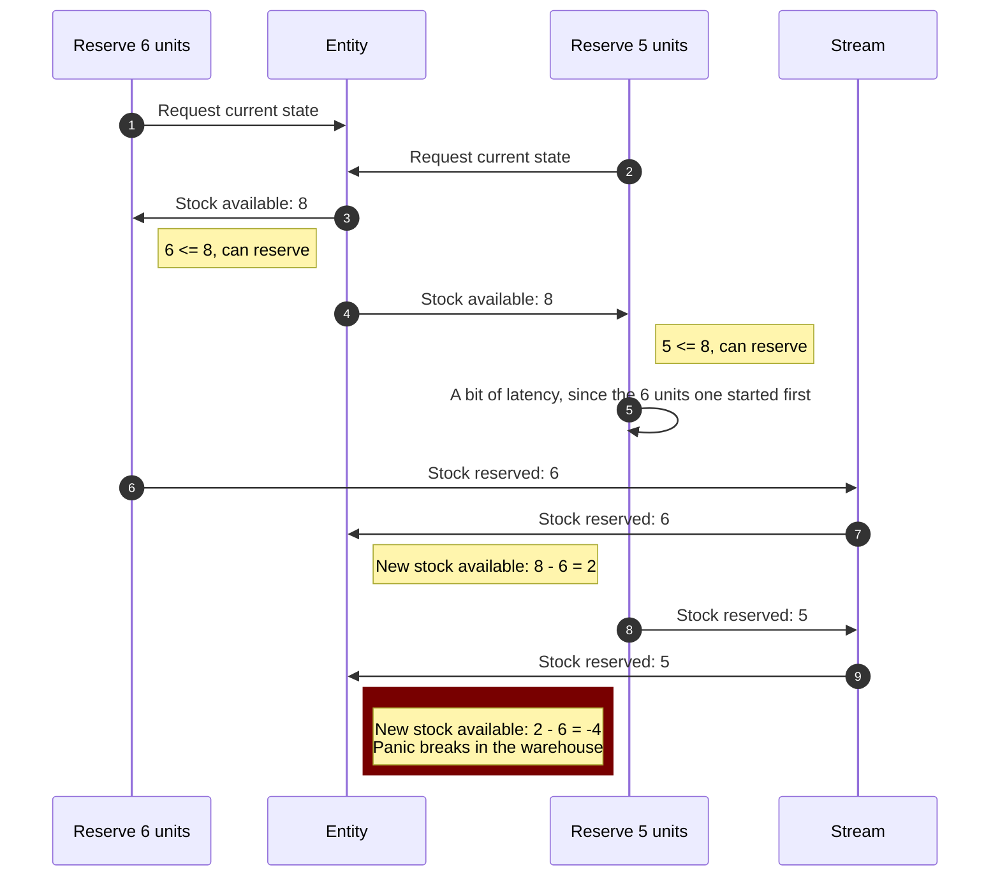

# Concurrency Aware Command Abstraction
## The problem
When we receive a command it is possible to request the entity in the handler, make a decision based on that information and emit the subsequent event.

At the moment of retrieving stock in an inventory management application, it should be possible to verify that there is enought units of the product available.

```ts
@Command({
  authorize: 'all'
})
export class ReserveStock {
  public constructor(
    readonly productId: UUID,
    readonly amount: number,
  ) {}

  public static async handle(command: ReserveStock , register: Register): Promise<{ hadEnough: boolean }> {
    const stock = 
      await Booster
        .entity(Stock, command.productId)
        .then(val => Stock.orDefault(command.productId, val));

    if (stock.amount < command.amount)
      return { hadEnough: false };

    register.events(new StockReserved(command.productId, command.amount))
    return { hadEnough: true };
  }
}
```

Afterwards, the entity will process the event, updating the amount value:

```ts
@Entity
export class Stock {
  public constructor(
    public readonly id: UUID,
    public readonly amount: number,
  ) {}

  @Reduces(StockReserved)
  public static reduceStockReserved(event: StockReserved, currentStock?: Stock): Stock {
    const stock = Stock.orDefault(event.entityID(), currentStock);
    return new Stock(stock.id, stock.amount - event.amount);
  }

  public static orDefault(id: UUID, current?: Stock): Stock {
    return current || new Stock(id, 0);
  }
}
```

The issue with this is that it is perfectly possible (and happens often) that a second consumer attempts the same command in the time the first takes to make the decision and insert the event into the stream.



