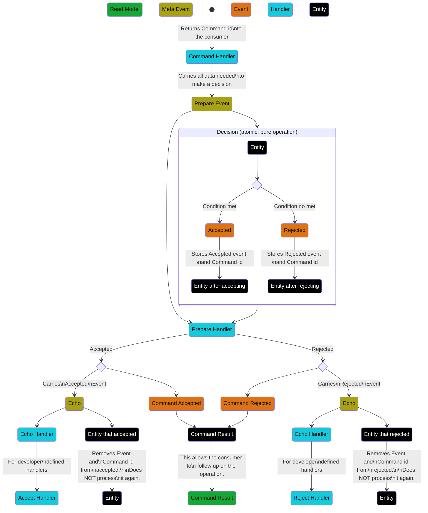

# Concurrency Aware Command Abstraction
## The problem
When a command is received it is possible to request the entity in the handler, make a decision based on that information and emit the resulting event, except it is not guaranteed that the emitted event will be inserted in a stream that is still consistent with the decision made.

### Example
At the moment of retrieving stock in an inventory management application, it should be possible to verify that there is enough units of the product available.

```ts
@Command({
  authorize: 'all'
})
export class ReserveStock {
  public constructor(
    readonly productId: UUID,
    readonly amount: number,
  ) {}

  public static async handle(command: ReserveStock , register: Register): Promise<{ hadEnough: boolean }> {
    const stock = 
      await Booster
        .entity(Stock, command.productId)
        .then(val => Stock.orDefault(command.productId, val));

    if (stock.amount < command.amount)
      return { hadEnough: false };

    register.events(new StockReserved(command.productId, command.amount))
    return { hadEnough: true };
  }
}
```

Afterwards, the entity will process the event, updating the amount value:

```ts
@Entity
export class Stock {
  public constructor(
    public readonly id: UUID,
    public readonly amount: number,
  ) {}

  @Reduces(StockReserved)
  public static reduceStockReserved(event: StockReserved, currentStock?: Stock): Stock {
    const stock = Stock.orDefault(event.entityID(), currentStock);
    return new Stock(stock.id, stock.amount - event.amount);
  }

  public static orDefault(id: UUID, current?: Stock): Stock {
    return current || new Stock(id, 0);
  }
}
```

The issue with this, is that it is perfectly possible (and often happens) that a second consumer attempts the same command in the time the first takes to make the decision and insert its event into the stream, rendering the decision made by the second one inconsistent.


## The journey to the solution
Booster is effectively a distributed runtime, but since the code is stateless, any form of network negotiation between instances would mean an engineering effort that is unlikely to succeed while keeping the serverless attractive of Booster. The only stateful place is the storage, which presents an interesting engineering puzzle in terms of resource economy, because in cases where storage is the only available state, locks are a well proven solution, but they present resource, performance and fault tolerance challenges that have some many "corner cases" that the term itself loses its meaning.

A pessimistic lock was immediately put aside, considering that an optimistic lock or a solution with no locks at all would be easier to maintain, less error-prone, and less expensive in terms of cloud bills, at least in the case of the no locks one, since it would mean fewer read/write operations. Only after failing to solve the problem deterministically with one of the others, this option would be considered again.

Since optimistic locking is usually the easier to maintain and the less error-prone of the three, a first attempt was made to solve the problem with an optimistic lock using a revision mechanism, and it revealed to be intensive in resources: With the number of meta-events used to handle the concurrency growing logistically, a form of exponential growth (common in epidemics, which is fitting, given how one could feel when looking at the cloud bill), with the amount of concurrent requests. Adding insult to injury, the metadata needed to handle the entity versioning would mean that this feature would only work with new entities defined as `Concurrency Aware`, or it would require a migration process that would warrant its own RFC.

The non-locking solution, showed a significant smaller resource footprint, a not-so-complex implementation, compatible with the current state of affairs, and significantly more performant.

## How the solution would look
If we had the solution already, its documentation would look like this:
### Concurrency Aware Commands
There are cases where absolute certainty that the event being emitted is consistent with the state of the system is required. One case would be making sure that a product only be reserved when there's enough stock. Lacking that certainty, two users could each claim a reservation over the last unit of a product. For this, we can use a `Concurrency Aware Command`.

```ts
@Command({
  authorize: 'all'
})
export class ReserveStock {
  public constructor(
    readonly productId: UUID,
    readonly amount: number,
  ) {}

  public static async fetch(
    command: ReserveStock,
    requestContext: RequestContext
  ): Promise<ReserveStockData> {
    return { amount: command.amount, productId: command.productId };
  }

  public static decide(
    stock: Stock,
    carrier: ReserveStockData
  ): Decision<StockReserved, StockReservationRejected> {
    return carrier.data.amount <= stock.amount
      ? { type: "accepted",
          event:
            new StockReserved(
              carrier.data.productId,
              carrier.data.amount,
              carrier.commandId) }
      : { type: "rejected",
          event:
            new StockReservationRejected(
              carrier.data.productId,
              carrier.data.amount,
              carrier.commandId) };
  }

  public entityID(): UUID {
    return this.productId;
  }
}

type ReserveStockData = { amount: number, productId: UUID };
```

The `fetch` function will request any information needed from the request context or any third parties, and produce all the information needed to decide whether to accept or reject the command. Notice that the `fetch` function receives a `RequestContext` instead of the standard `Register`, this is because the decision as to which event to send has not been made yet.

The `decide` function will then receive that information and will, as its name implies, accept or reject the command, the rejection event is optional and can be typed as `void`.

The `Decision` type looks like this:
```ts
export type Decision<Evt, RejEvt> =
  { type: "accepted", event: Evt } |
  { type: "rejected", event: RejEvt }
```
Event handlers and entities for this kind of commands and events look exactly the same.

These commands are meant to act on a single entity, so you need to implement the `entityID` member. Also, the emitted events do not need such member, it is recommended, for the sake of convenience, to implement it, though.

The endpoint for the command will always return an object in the shape of `{ commandId: UUID }`, with this identifier, we can query the `AsyncCommandState` endpoint:
```graphql
query {
  AsyncCommandState(id: "ad920755-f593-46e8-9960-ba4f606893f3") {
    state
  }
}
```

Which will return:
```json
{
  "data": {
    "AsyncCommandState": null
  }
}
```
Until the command has been processed, returning then:
```json
{
  "data": {
    "AsyncCommandState": {
      "state": "accepted"
    }
  }
}
```

## Notes on the solution API
Two important parts are not represented in the documentation:
1. The way to define the "data", "success event" and "rejection event".
1. How would the CLI look like.

Requesting suggestions on this part.

## The inner works of the solution
The command handler will run the fetch function, and insert that data in a `meta event` called `Prepare` that carries the data needed to make the decision and the identifier of the command.

The runtime will then intercept the reduction of that event, which will not be visible to the consumer, and will call the `decide` function on the handler, reducing the resulting event on the entity directly. After that, it will insert the event, together with the command identifier in one of two collections that will be on the metadata of the entity, the `rejected` or `accepted` one, depending on the decision.

An internal handler, not visible for the consumer, will receive the `Prepare` event and will, depending on whether the entity has the command in the `Accept` or in the `Reject` collection:
- Emit a `Command Accepted` or `Command Rejected` event.
- Emit an `Echo` event that carries either of the events.

### The Echo event
The entity, then, will reduce the `Echo` event by removing the contained event from the corresponding internal collection, ignoring the actual event, because it was already reduced.

Another handler, the `Echo` handler will then trigger any handlers defined for the Acceptance or Rejection events.

### The Command Accepted/Rejected event
These events exist only to update the `Command Result` entity, which will project into its own read model `AsyncCommandState`, which the consumer can use to get the result of the operation.

### A diagram of the solution


