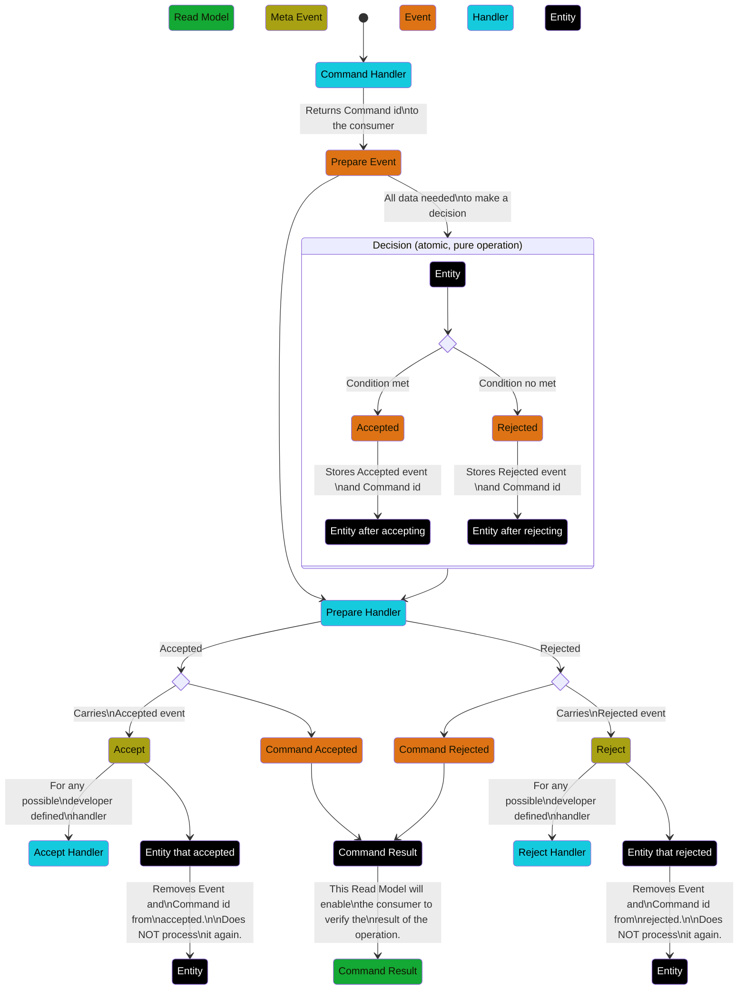

# Concurrency Aware Command Abstraction
## The problem
When a command is received it is possible to request the entity in the handler, make a decision based on that information and emit the resulting event, except it is not guaranteed that the emitted event will be inserted in a stream that is still consistent with the decision made.

### Example
At the moment of retrieving stock in an inventory management application, it should be possible to verify that there is enough units of the product available.

```ts
@Command({
  authorize: 'all'
})
export class ReserveStock {
  public constructor(
    readonly productId: UUID,
    readonly amount: number,
  ) {}

  public static async handle(command: ReserveStock , register: Register): Promise<{ hadEnough: boolean }> {
    const stock = 
      await Booster
        .entity(Stock, command.productId)
        .then(val => Stock.orDefault(command.productId, val));

    if (stock.amount < command.amount)
      return { hadEnough: false };

    register.events(new StockReserved(command.productId, command.amount))
    return { hadEnough: true };
  }
}
```

Afterwards, the entity will process the event, updating the amount value:

```ts
@Entity
export class Stock {
  public constructor(
    public readonly id: UUID,
    public readonly amount: number,
  ) {}

  @Reduces(StockReserved)
  public static reduceStockReserved(event: StockReserved, currentStock?: Stock): Stock {
    const stock = Stock.orDefault(event.entityID(), currentStock);
    return new Stock(stock.id, stock.amount - event.amount);
  }

  public static orDefault(id: UUID, current?: Stock): Stock {
    return current || new Stock(id, 0);
  }
}
```

The issue with this, is that it is perfectly possible (and often happens) that a second consumer attempts the same command in the time the first takes to make the decision and insert its event into the stream, rendering the decision made by the second one inconsistent.


## The journey to the solution
Booster is effectively a distributed runtime, but since the code is stateless, any form of network negotiation between instances would mean an engineering effort that is unlikely to succeed while keeping the serverless attractive of Booster. The only stateful place is the storage, which presents an interesting engineering puzzle in terms of resource economy, because in cases where storage is the only available state, locks are a well proven solution, but they present resource, performance and fault tolerance challenges that have some many "corner cases" that the term itself loses its meaning.

A pessimistic lock was immediately put aside, considering that an optimistic lock or a solution with no locks at all would be easier to maintain, less error-prone, and less expensive in terms of cloud bills, at least in the case of the no locks one, since it would mean fewer read/write operations. Only after failing to solve the problem deterministically with one of the others, this option would be considered again.

Since optimistic locking is usually the easier to maintain and the less error-prone of the three, a first attempt was made to solve the problem with an optimistic lock using a revision mechanism, and it revealed to be intensive in resources: With the number of meta-events used to handle the concurrency growing logistically, a form of exponential growth (common in epidemics, which is fitting, given how one could feel when looking at the cloud bill), with the amount of concurrent requests. Adding insult to injury, the metadata needed to handle the entity versioning would mean that this feature would only work with new entities defined as `Concurrency Aware`, or it would require a migration process that would warrant its own RFC.

The non-locking solution, showed a significant smaller resource footprint, a not-so-complex implementation, compatible with the current state of affairs, and significantly more performant.

## How the solution would look
If we had the solution already, its documentation would look like this:
### Concurrency Aware Commands
There are cases where absolute certainty that the event being emitted is consistent with the state of the system is required. One case would be making sure that a product only be reserved when there's enough stock. Lacking that certainty, two users could each claim a reservation over the last unit of a product. For this, we can use a `Concurrency Aware Command`.


### The resulting diagram

